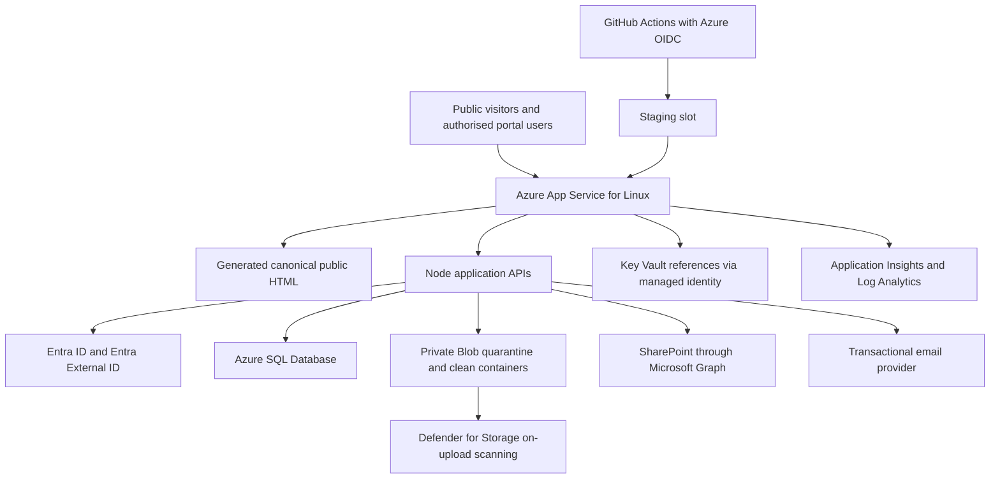

# ADR-005: Azure Production Platform Migration

Status: accepted for implementation; cloud deployment remains owner-controlled  
Decision date: 14 July 2026  
Decision owners: NovaPharm Healthcare Ltd and digital platform engineering

## Context

NovaPharm has a generated public website and a custom Node application. Public content is already emitted as complete HTML, has stable canonical URLs and passes strong repository SEO/claims checks. The application uses synchronous SQLite, local persistent files and local credentials. GitHub Pages serves the public site but cannot execute authenticated APIs.

Two paths were assessed:

- **Path A:** preserve the public generator and current Node domain behaviour while replacing production hosting, identity, data, files, secrets, telemetry and CI/CD with Azure-managed services.
- **Path B:** immediately rebuild public and portal experiences in TypeScript, React and Next.js before platform migration.

## Decision

Choose **Path A** for the production migration.

Deploy the conventional Node application to **Azure App Service for Linux** on a production-capable dedicated tier with Always On, a staging slot, managed identity, health checks and controlled scale. Replace SQLite with **Azure SQL Database**, private files with **Azure Blob Storage**, local workforce/customer credentials with **Microsoft Entra ID and Microsoft Entra External ID**, host secrets with **Azure Key Vault references**, and local-only logs with **Application Insights and Log Analytics**.

Retain generated, server-readable public HTML during migration. Introduce TypeScript at cloud boundaries and new modules; do not force a full React/Next rewrite into the security migration. Reassess Next.js after Azure cutover when a verified need exists for a CMS, richer product applications, React component reuse or a larger editorial team.

## Target architecture

## Why not Path B now

| Consideration | Path A | Path B |
|---|---|---|
| Immediate security value | Directly replaces identity/data/file/secret boundaries | Delays those controls behind a frontend rewrite |
| SEO/GEO | Preserves complete generated HTML and current URLs | Can be excellent, but requires parity migration and redirect risk |
| Portal compatibility | Existing route and test contracts can be migrated incrementally | Requires substantial UI/API reimplementation |
| Database effort | High but isolated to persistence/domain boundaries | Same database effort plus framework migration |
| Downtime | Parallel Azure deployment and DNS cutover | Longer parallel build and content parity period |
| Rollback | Return DNS to unchanged GitHub Pages public site | Harder if routes/content/rendering change together |
| Maintainability | Improved through modular cloud adapters and TypeScript at new boundaries | Potentially stronger frontend model after larger rewrite |
| Cost | App Service, SQL, Storage, Key Vault and monitoring | Same platform costs plus migration engineering |
| CMS future | Generator remains code-owned | Next.js better when a real editorial/CMS requirement is approved |

Next.js is not rejected. It is sequenced after the operational trust boundary is managed and observable.

## Azure hosting decision

Use **Azure App Service for Linux** rather than Container Apps for the first production release because:

- this is one conventional persistent HTTP application, not a multi-service container topology;
- deployment slots, managed certificates, Easy Auth, managed identity, health checks and Key Vault references are native;
- a dedicated instance avoids an intentional scale-to-zero cold start on a secure portal;
- operational ownership is simpler for a small company;
- the current Dockerfile remains a portability and disaster-recovery option.

Container Apps Consumption remains suitable for later stateless workers or bursty integration jobs. It is not automatically cheaper once a minimum always-on replica, private networking, logs and operational complexity are included.

## Identity decision

- Employees, board and administrators authenticate through the NovaPharm workforce Entra tenant.
- Customers and external partners authenticate through Entra External ID after account approval or invitation.
- App Service Authentication validates federated sessions; the application still enforces roles, scopes, customer isolation and resource ownership server-side.
- App roles are `customer`, `employee`, `board`, `admin`.
- Vishal Chakravarty is mapped to all four scopes. The public designation remains `Chief Executive Officer`; founder/statutory-director facts remain separate.
- Privileged access requires MFA and, where licensed and approved, Conditional Access.
- The local bootstrap credential remains a time-limited migration/recovery mechanism only and cannot open confidential board/admin data until its forced change is complete.

## Data and file decisions

- Azure SQL Database is the canonical system of record. Managed identity is preferred; a Key Vault credential is a temporary fallback only.
- Runtime and migration roles are separated where practical.
- Staging, production and development use different databases, storage containers, identities, secrets and external-provider settings.
- Public uploads enter a private quarantine container. A database record remains `pending_scan` until Defender for Storage returns a clean result. Only then may an authorised workflow promote the object to the clean container or SharePoint.
- No private blob receives anonymous access. Downloads are streamed through authorised application routes or short-lived, narrowly scoped user-delegation URLs.

## Network decision

The production design uses App Service VNet integration, private endpoints for Azure SQL, Storage and Key Vault where the selected tier/region supports them, private DNS zones, HTTPS-only ingress, minimum TLS 1.2 and SCM restrictions. Public database access is disabled after provisioning/migration access is complete.

## Availability and recovery

- Production uses a paid App Service tier; Free/Shared tiers are prohibited.
- Default infrastructure parameters begin with two production instances where budget approval permits. A one-instance release must be recorded as an accepted availability risk.
- Azure SQL point-in-time restore, Blob soft delete/versioning and deployment-slot rollback are required.
- The unchanged GitHub Pages site remains the public rollback until Azure acceptance and a defined stabilisation period complete.

## Consequences

Positive:

- the migration addresses the material trust boundaries first;
- current search equity and public content survive;
- Azure-managed identity and data access reduce secret and desktop-server risk;
- cloud infrastructure becomes repeatable and observable.

Trade-offs:

- the custom Node server and generator remain temporarily;
- moving synchronous SQLite logic to asynchronous Azure SQL repositories is a real application refactor;
- Entra External ID and tenant roles require owner/tenant administration;
- Defender malware scanning, App Service, SQL, monitoring and private networking incur charges;
- a later React/Next migration may still be desirable.

## Evidence sources

- [Azure App Service authentication and authorisation](https://learn.microsoft.com/en-us/azure/app-service/overview-authentication-authorization)
- [App Service managed identities](https://learn.microsoft.com/en-us/azure/app-service/overview-managed-identity)
- [App Service Key Vault references](https://learn.microsoft.com/en-us/azure/app-service/app-service-key-vault-references)
- [App Service deployment slots](https://learn.microsoft.com/en-us/azure/app-service/deploy-staging-slots)
- [Node.js passwordless Azure SQL connection](https://learn.microsoft.com/en-us/azure/azure-sql/database/azure-sql-javascript-mssql-quickstart)
- [Microsoft Entra External ID](https://learn.microsoft.com/en-us/entra/external-id/external-identities-overview)
- [Defender for Storage malware scanning](https://learn.microsoft.com/en-us/azure/defender-for-cloud/introduction-malware-scanning)
- [Azure Monitor OpenTelemetry for Node.js](https://learn.microsoft.com/en-us/azure/azure-monitor/app/opentelemetry-enable)

