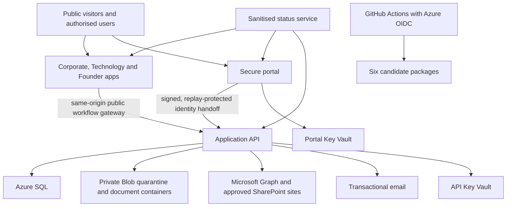

# ADR-005: Unified Azure Production Platform

Status: accepted and implemented in the repository; managed deployment remains owner-controlled
Original decision: 14 July 2026
Reconciled with the unified estate: 1 August 2026

This record supersedes the earlier single-App-Service variant of ADR-005. The detailed migration decision and evidence are maintained in `docs/programme/architecture-decision-record.md` and `docs/programme/azure-unified-estate-acceptance.md`.

## Decision

Use the hardened Node/Next.js strangler path already implemented in this repository. Deploy six independently packaged applications to Azure App Service for Linux:

1. Corporate public website
2. Innovation and Technology public website
3. Founder public website
4. Secure portal
5. Application API
6. Sanitised public status service

The four public/status applications share a public App Service plan. Portal and API share a separate secure plan but retain separate processes, managed identities and package boundaries. Azure SQL is the transactional source of truth. Private Azure Blob containers hold uploads and authorised documents. Microsoft Entra governs workforce and approved external identities. Separate portal and API Key Vaults prevent a public or portal compromise from inheriting database, document, email or session secrets.

```mermaid
flowchart TB
  USERS["Public visitors and authorised users"] --> PUBLIC["Corporate, Technology and Founder apps"]
  USERS --> PORTAL["Secure portal"]
  PUBLIC -->|"same-origin public workflow gateway"| API["Application API"]
  PORTAL -->|"signed, replay-protected identity handoff"| API
  STATUS["Sanitised status service"] --> PUBLIC
  STATUS --> PORTAL
  STATUS --> API
  API --> SQL["Azure SQL"]
  API --> BLOB["Private Blob quarantine and document containers"]
  API --> GRAPH["Microsoft Graph and approved SharePoint sites"]
  API --> MAIL["Transactional email"]
  PORTAL --> PKV["Portal Key Vault"]
  API --> AKV["API Key Vault"]
  GHA["GitHub Actions with Azure OIDC"] --> APPS["Six candidate packages"]
```

## Why this path

- It preserves approved routes, content, imagery and search equity while replacing the broken static/runtime boundary.
- It isolates public presentation, privileged user experience and data APIs without introducing container orchestration that NovaPharm does not yet need.
- App Service provides managed identity, health checks, candidate slots, managed certificates and operational simplicity for conventional persistent Node applications.
- The repository now uses strict TypeScript workspaces and five Next.js standalone applications while retaining the tested API domain implementation behind a dedicated compiled entry point.
- Production slot promotion, DNS, Microsoft permissions and GitHub Pages retirement remain explicit owner-controlled gates.

## Data, identity and documents

- Azure SQL is authoritative for identity linkage, scopes, sessions, applications, customers, transactions, consent and audit events.
- SharePoint Lists may expose controlled Microsoft 365 work views but do not replace security or transactional records.
- SharePoint document libraries hold approved controlled records under least privilege. OneDrive is not an application backend.
- Public uploads enter a private quarantine container. Release requires an approved malware result and authorised workflow.
- Employees, board and administrators use workforce Entra; approved customers use Entra External ID or the currently supported invitation-based Microsoft external identity service.
- Server-side role, scope, customer ownership and document authorisation remain mandatory after identity-provider validation.

## Production controls

- Node 24, HTTPS only, TLS 1.2 minimum, FTPS disabled and Always On on paid Standard-or-better plans.
- Private endpoints for SQL, Blob and both vaults; portal/API VNet integration.
- Separate production and candidate SQL databases, private containers, identities and secrets.
- Application Insights and Log Analytics with sensitive telemetry suppression.
- OIDC deployment from an exact reviewed SHA; production packages go only to candidate slots.
- No workflow command swaps slots, changes DNS, binds domains, changes SharePoint permissions or retires GitHub Pages.

## Open owner-controlled gates

The repository decision does not prove Azure cost approval, tenant configuration, Entra/MFA, Graph consent, SharePoint least privilege, email delivery, Azure migration/reconciliation, malware scanning, backup restoration, penetration testing, managed visual acceptance or production cutover. These remain required before production completion.
