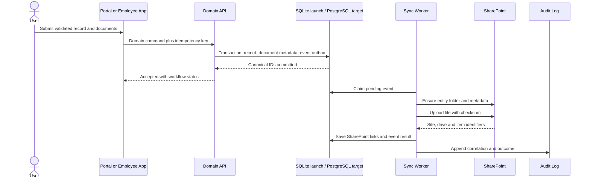
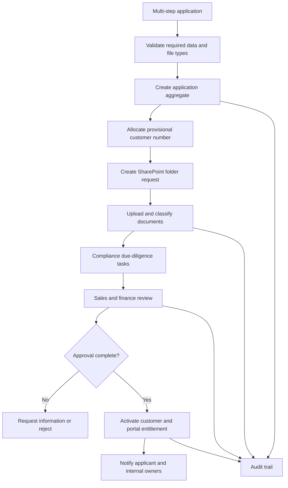
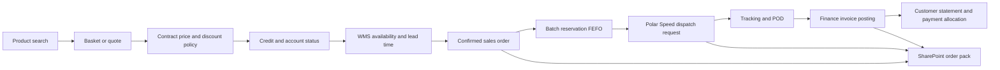
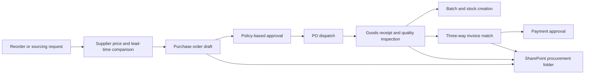
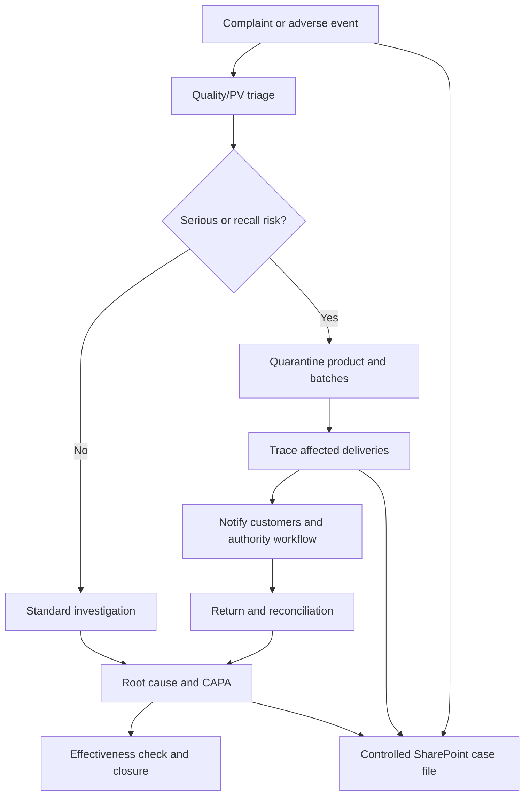
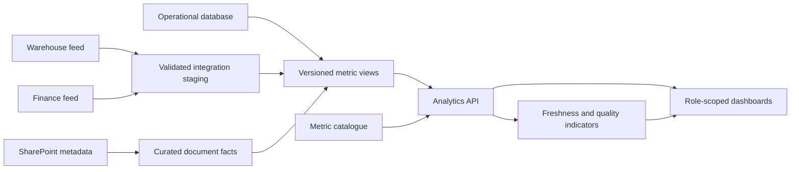

# Data Flow Diagrams

## Record Creation And SharePoint Synchronization

## Customer Account Opening

## Order To Cash

## Procure To Pay

## Quality Complaint And Recall

## Analytics Flow

## Failure Handling

No external call is made inside a user request transaction. A committed outbox event guarantees delivery attempts. Failed events retain correlation ID, attempt count, safe error code and next retry time; credentials and document content are never written to error logs.
