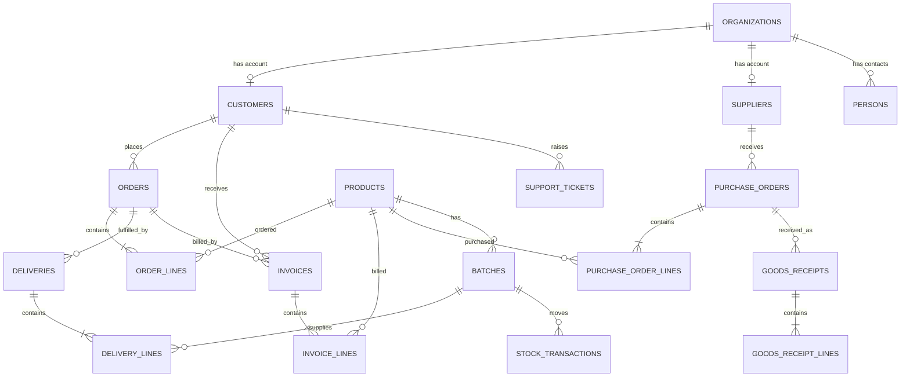
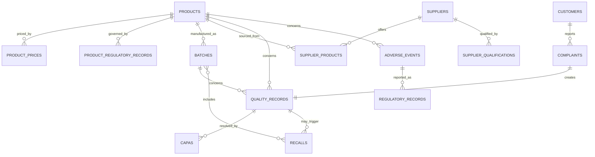
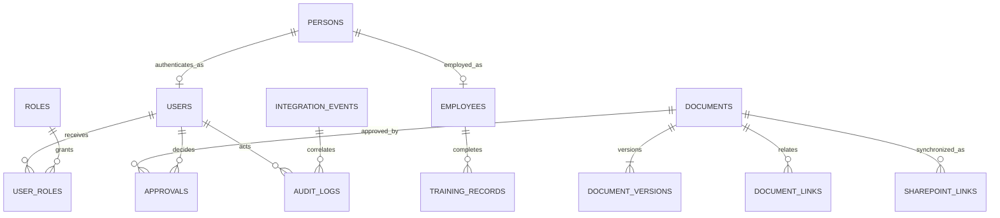

# Entity Relationship Diagrams

These diagrams describe the target logical domain. `database/schema.sql` is the implemented launch model; entities such as deliveries, returns, CAPA, recalls and dedicated document-version rows remain target-state extensions and must not be interpreted as deployed functionality.

## Operational Core

## Product, Quality And Regulatory

## Identity, Documents And Audit

## Polymorphic Link Controls

`document_links`, upload operations and SharePoint mappings currently use application-maintained entity allowlists. The PostgreSQL migration should add an entity registry and database enforcement for polymorphic references. Free-form entity types must remain forbidden.

## Required Unique Constraints

- `customers.customer_number`
- `suppliers.supplier_number`
- `products.sku`
- `products.gtin` when present
- `batches(product_id, batch_number)`
- `orders.order_number`
- `purchase_orders.po_number`
- `invoices.invoice_number`
- `documents.document_number`
- `users.entra_object_id`
- `sharepoint_links(site_id, drive_id, item_id)`
- `integration_events(destination_system, idempotency_key)`

## Required Referential Behaviours

- Master records referenced by financial, regulated or warehouse transactions use `RESTRICT` on delete.
- Line records cascade only from unposted drafts; posted aggregates are immutable and corrected with reversal records.
- User removal nulls the active login but preserves actor snapshots in the audit trail.
- Document versions are append-only.
