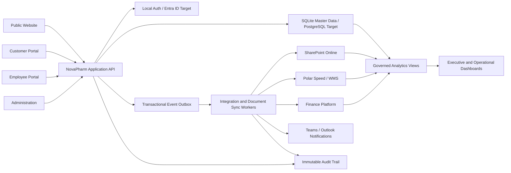

# System Relationships

## Systems Of Record

| Capability | Authoritative system | NovaPharm responsibility |
|---|---|---|
| Identity | NovaPharm local auth at launch; Microsoft Entra ID target | role mapping, persistent session enforcement, scoped access |
| Operational master data | Persistent SQLite at launch; managed PostgreSQL target | validation, workflow, canonical IDs, APIs |
| Controlled documents | SharePoint Online | metadata, lifecycle, version links, permissions |
| Finance | approved finance platform | order-to-cash and procure-to-pay synchronization |
| Physical inventory and dispatch | Polar Speed/WMS | inventory projection, reservation requests, status reconciliation |
| Website and portals | NovaPharm application | user experience and governed service orchestration |
| Analytics | governed operational views / Power BI | metric definitions, freshness and lineage |

## Relationship Map

## Domain Ownership

| Domain | Owns | May reference | Must not duplicate |
|---|---|---|---|
| Customer | account lifecycle, contacts, credit policy references | orders, invoices, contracts, tickets | product or invoice master data |
| Product | product identity, regulatory state, sellability | suppliers, prices, stock, documents | customer-specific order data |
| Sales | quotes, orders, pricing decisions | customer, product, credit result | customer or product master fields |
| Purchasing | POs, receipts, matching workflow | supplier, product, stock | supplier qualification master |
| Warehouse | stock movements, allocations, dispatch status | product, batch, order | financial totals |
| Finance | invoices, payments, statements | customer, order, PO | customer identity |
| Quality | complaints, deviations, CAPA, recalls | product, batch, customer, supplier | document binary or product master |
| Regulatory | licences, submissions, authority status | product, supplier, documents | quality events |
| Documents | metadata, versions, links, lifecycle | every domain entity | business record state |

## Integration Contract

Every outbound integration uses an `integration_events` row written in the same database transaction as the business change. Workers claim events, apply an idempotency key, call the external system, write cross-system identifiers, append an audit event and retry with bounded exponential backoff. Permanent failures enter a dead-letter state and surface in administration.

Every inbound integration uses the external event ID plus source system as a unique key. Payloads are schema-validated before domain commands are executed. Raw external payloads are retained only as long as required for troubleshooting and regulation.

## Role Scope

| Role | Scope |
|---|---|
| Customer User | own customer account, orders, invoices, tickets and approved documents |
| Customer Administrator | customer users, addresses and account preferences |
| Sales | customers, quotes and orders; read stock and credit decisions |
| Purchasing | suppliers, sourcing and purchase orders |
| Warehouse | batches, stock, receipts, allocations, dispatch and returns |
| Finance | invoices, payments, statements and credit controls |
| Quality | QMS records, complaints, CAPA, recalls and controlled documents |
| Regulatory | licences, submissions, authority records and regulatory documents |
| Executive | governed cross-domain analytics; no unrestricted personal-data export |
| System Administrator | configuration and access administration; no implicit business approval rights |

## Consistency Boundaries

- Strong consistency: identifiers, lifecycle transitions, prices used on an order, credit decision, stock reservation request, approvals and event creation.
- Eventual consistency: SharePoint folder/file creation, external finance posting, WMS status, notifications and analytics refresh.
- Reconciliation: each connector exposes pending, succeeded, retrying and failed counts plus last successful checkpoint.
