# Enterprise portal relationship model

- Version: 1.0
- Reviewed: 2026-07-16

```mermaid
erDiagram
  ORGANIZATIONS ||--o| CUSTOMERS : represents
  ORGANIZATIONS ||--o| SUPPLIERS : represents
  CUSTOMERS ||--o{ CUSTOMER_CONTACTS : authorises
  CUSTOMERS ||--o{ ORDERS : places
  ORDERS ||--|{ ORDER_LINES : contains
  PRODUCTS ||--o{ ORDER_LINES : ordered_as
  ORDERS ||--o{ SHIPMENTS : fulfilled_by
  SHIPMENTS ||--o{ DELIVERY_EVENTS : reports
  ORDERS ||--o{ INVOICES : billed_as
  INVOICES ||--o{ PAYMENTS : settled_by
  CUSTOMERS ||--o{ CUSTOMER_STATEMENTS : receives
  ORDERS ||--o{ RETURNS : may_create
  RETURNS ||--o{ CREDIT_NOTES : may_generate
  PRODUCT_FAMILIES ||--o{ PRODUCT_VARIANTS : groups
  PRODUCTS ||--o| PRODUCT_VARIANTS : describes
  PRODUCTS ||--o{ PRODUCT_COMPOSITION_ITEMS : contains
  PRODUCTS ||--o{ PRODUCT_CLAIMS : governs
  PRODUCTS ||--o{ PRODUCT_MEDIA : presents
  PRODUCTS ||--o{ BATCHES : identifies
  BATCHES ||--o{ INVENTORY_BALANCES : held_as
  INVENTORY_LOCATIONS ||--o{ INVENTORY_BALANCES : stores
  SUPPLIERS ||--o{ PURCHASE_ORDERS : receives
  PURCHASE_ORDERS ||--|{ PURCHASE_ORDER_LINES : contains
  PURCHASE_ORDERS ||--o{ GOODS_RECEIPTS : received_as
  SUPPLIER_INVOICES ||--o{ INVOICE_MATCHES : reconciled_by
  QUALITY_COMPLAINTS ||--o{ QUALITY_ACTIONS : drives
  QUALITY_COMPLAINTS ||--o{ CAPA_RECORDS : may_drive
  PRODUCTS ||--o{ REGULATORY_CASES : assessed_by
  REGULATORY_CASES ||--o{ REGULATORY_MILESTONES : contains
  DOCUMENTS ||--o{ DOCUMENT_VERSIONS : versions
  DOCUMENTS ||--o{ DOCUMENT_APPROVALS : governed_by
  WORKFLOW_INSTANCES ||--o{ WORKFLOW_STEPS : contains
  DOMAIN_EVENTS ||--o{ OUTBOX_MESSAGES : projects
  USERS ||--o{ AUTH_SESSIONS : authenticates
  USERS ||--o{ AUTH_USER_SCOPES : authorises
```

## Critical relationship controls

- Customer APIs join every customer-owned record through the authenticated customer identifier.
- Order, invoice, return, complaint and document relationships cannot be selected across customer accounts.
- Product activation for owner-supplied Nutraxin records is blocked unless claims, sale status and regulatory classification are all approved.
- Posted journals must have equal debit and credit totals.
- Quarantine quantities are excluded from released available-to-promise quantities.
