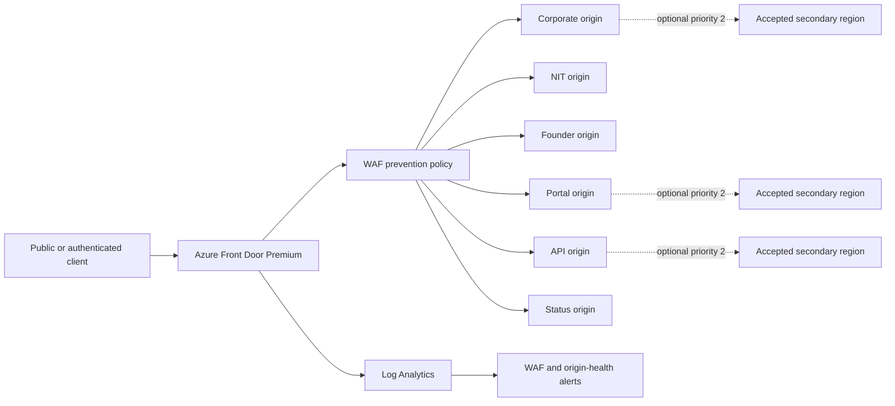

# Azure Front Door Edge Architecture

Status: implemented and compiled at repository level; not deployed
Review date: 1 August 2026
Owner: Platform and Security Engineering

## Decision

The paid staging and production target uses Azure Front Door Premium with Azure WAF. This closes the source-architecture gap without claiming that TLS certificates, WAF rules, health probes, logs, alerts or failover have been exercised in Azure. The cost-gated free-validation templates remain intentionally outside this edge design.

## Route contract

| Application | Production host | Candidate boundary | Health probe | Data sensitivity |
|---|---|---|---|---|
| Corporate | `novapharmhealthcare.com` and `www` | Separate generated endpoint | `/api/health` | Public; form gateway only |
| Technology | `nit.novapharmhealthcare.com` | Separate generated endpoint | `/api/health` | Public |
| Founder | `vishal.novapharmhealthcare.com` | Separate generated endpoint | `/api/health` | Public |
| Portal | `portal.novapharmhealthcare.com` | Separate generated endpoint | `/api/health` | Authenticated, no shared caching |
| API | `api.novapharmhealthcare.com` | Separate generated endpoint | `/api/health` | Transactional and private |
| Status | `status.novapharmhealthcare.com` | Separate generated endpoint | `/api/health` | Sanitised public status only |

All route hostnames are declarations, not evidence that DNS has changed or certificates have issued.

## Implemented controls

- Premium Azure Front Door profile with system-assigned identity.
- WAF in `Prevention` mode.
- Microsoft Default Rule Set `2.2` and Bot Manager `1.1`.
- Per-client global rate limit and a stricter authentication/form/portal-path rate limit.
- HTTPS redirect and HTTPS-only origin forwarding.
- Certificate-name checking on every origin.
- Thirty-second `HEAD` health probes with five samples and three required successes.
- Candidate endpoints isolated from production custom domains.
- Optional priority-two secondary origins; disabled until the second region exists.
- App Service origin allow rule for `AzureFrontDoor.Backend` plus exact `X-Azure-FDID`; default access denied.
- Access, health-probe and WAF logs sent to Log Analytics.
- Scheduled alerts for WAF-block spikes and origin health failures.

## Evidence

| Evidence | Location |
|---|---|
| Core edge resources | `infra/modules/front-door-core.bicep` |
| Per-application routes | `infra/modules/front-door-application.bicep` |
| Origin restriction | `infra/modules/web-app.bicep` |
| Six-app composition | `infra/unified-estate.bicep` |
| Production declaration | `infra/environments/unified-production.bicepparam` |
| Compiled-contract validator | `scripts/validate-unified-estate-infrastructure.mjs` |

Repository validation compiles both the Bicep template and production parameters and inspects the resulting ARM contract. That proves syntax and declared topology only.

## External activation gates

1. Owner approves Azure charges, region and deployment window.
2. A second region is provisioned and accepted before `enableRegionalFailover` becomes true.
3. DNS ownership is validated and managed certificates issue.
4. Each origin and candidate route passes live health, host, cache and authentication checks.
5. WAF managed rules and both rate rules are exercised with safe test traffic.
6. Bot policy is checked against verified crawler IP/DNS guidance to avoid blocking legitimate search crawlers.
7. Log ingestion and both alert actions are triggered and acknowledged.
8. Direct App Service origins reject requests without the exact Front Door identifier.
9. Failover and restoration are rehearsed before production acceptance.

No item in this section is production evidence until its Azure resource identifier, timestamp and test output are added to the production acceptance report.
