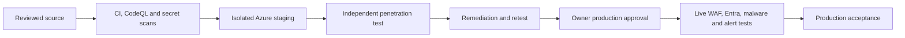

# Security Governance Gates

Status: repository controls implemented; organisation and live-service controls remain external
Review date: 9 August 2026
Owner: Security, Platform and Corporate Governance

## Control register

| Control | Repository status | Live or owner-controlled gate | Acceptance evidence |
|---|---|---|---|
| CodeQL | Workflow implemented in `.github/workflows/codeql.yml` with immutable `github/codeql-action` commit pins, `security-extended`, PR/main/scheduled triggers | GitHub code scanning must be available and the final PR run must complete | Successful check URL and zero unresolved high/critical findings |
| Ownership and dependency automation | `.github/CODEOWNERS`, `.github/dependabot.yml` and `.github/workflows/supply-chain.yml` implemented | GitHub must recognise the owner, run dependency review and retain the generated CycloneDX SBOM | Successful dependency-review/SBOM checks and downloadable checksum-protected artifact |
| Security and contribution policy | `SECURITY.md` and `CONTRIBUTING.md` implemented | Confirm the monitored security mailbox and organisational response ownership | Controlled test message and owner acknowledgement |
| Branch protection | Not configurable in source | Owner enables ruleset on `main` | Ruleset export/screenshot and blocked unreviewed push test |
| Required reviews | Not configurable in source | Require at least one independent approving reviewer and dismissal after new commits | PR evidence with expected head SHA and review |
| Repository visibility | Decision pending | Owner and legal/security decide whether public source remains appropriate | Recorded decision and risk acceptance or private-repository change evidence |
| Independent penetration test | Not performed | Qualified independent tester after staging deployment | Signed scope, report, remediation and retest evidence |
| Live WAF | IaC implemented | Deploy Front Door Premium/WAF and run safe managed/custom-rule acceptance | Azure IDs, logs, blocked/allowed requests and alert evidence |
| Entra MFA | Identity contracts implemented | Tenant administrator activates and tests MFA for privileged workforce identities | Sign-in logs and approved test identities |
| Conditional Access | Policy documented only | Requires tenant licensing and administrator approval | Policy export and successful/blocked sign-in matrix |
| Privileged Identity Management | Not active | Requires eligible licensing and governance approval | Role eligibility/activation evidence or documented compensating control |
| Malware scanning | Quarantine and scan-state contracts implemented; synthetic scanner only | Approve and activate Defender for Storage or a qualified alternative | Harmless test-file detection, quarantine/release and alert evidence |
| Production alerts | Alert IaC implemented | Deploy and trigger each alert safely | Alert delivery, acknowledgement and escalation record |
| Historical pull references | Reachable branches/tags are scanned; GitHub-managed historical pull refs cannot be deleted from ordinary Git | GitHub Support must assess and remove affected managed refs where possible | Support case and follow-up all-ref scan |
| Immutable action pinning | All third-party workflow actions are pinned to reviewed full commit SHAs; version lines remain as comments | Dependabot updates require review and the supply-chain validator rejects mutable refs | `npm run supply-chain:validate` and reviewed workflow diff |
| Release notes and changesets | `CHANGELOG.md`, `.changeset/config.json` and reviewed workspace changesets are implemented and CI validated | Convert Unreleased to a versioned heading only for an approved immutable production SHA | `npm run supply-chain:validate`, release PR and deployment manifest |
| Dependency licences | Lockfile SPDX inventory and fail-closed policy implemented | UK solicitor reviews final distribution obligations, including LGPL and CC-BY notices | `config/dependency-license-policy.json`, audit report and `npm run supply-chain:validate` |
| Dependency vulnerability floor | React/React DOM `19.2.8`, Next.js `16.2.12`, transitive `nanoid` `3.3.18` and transitive `js-yaml` `3.15.1` are pinned in both temporary migration lock graphs; production-only and full npm audits report zero known vulnerabilities | Re-run official advisory and registry checks on the exact deployment SHA | npm clean install, pnpm frozen-lockfile validation, `npm audit --omit=dev --audit-level=high`, full `npm audit` and `docs/programme/react-architecture-handoff.md` |
| Static-analysis hardening | Browser navigation is mapped locally, audit digests are keyed, HTML evidence is parsed structurally, file reads/re-writes use stable descriptors, and approved media acquisition is source/destination allowlisted | The exact pushed SHA must complete GitHub CodeQL with no unresolved release-blocking finding | Local security suites, source review and the exact-SHA CodeQL check URL |

## Required `main` ruleset

Configure a GitHub repository ruleset with:

- pull request required before merge;
- at least one independent approval;
- approval dismissed when the head changes;
- conversation resolution required;
- force push and branch deletion blocked;
- linear history or squash merge only;
- signed commits where the organisation can support them;
- required status checks for CI, browser acceptance, CodeQL, secret scanning and infrastructure validation;
- required status checks for dependency review and SBOM generation;
- branch must be up to date before merge;
- administrator bypass limited to documented emergency use.

Repository settings evidence is intentionally not represented by a YAML file. A workflow cannot prove that a ruleset is enforced.

## Security release gates

Any critical secret, authentication bypass, authorisation bypass, customer-isolation failure, private-file exposure, injection issue, failed malware gate or unremediated penetration-test critical/high finding blocks release.

## Repository-private decision

The current public repository increases transparency and reproducibility but also exposes implementation detail, infrastructure names and security architecture. It must never contain secrets or confidential records regardless of visibility. The owner must choose one of:

1. retain public visibility with explicit risk acceptance, minimal operational detail and continuous secret/code scanning; or
2. move the canonical repository to private visibility while preserving any intentionally open public assets separately.

Changing visibility can affect Pages, forks, Actions minutes, external links and contributor access. It is therefore an owner-controlled governance change, not an automatic remediation.

## Penetration-test scope

The independent scope must include Front Door/WAF bypass, origin exposure, Entra and External ID, bootstrap retirement, sessions, CSRF, IDOR/customer isolation, Graph/SharePoint access, SQL injection, XSS, upload/MIME/path traversal, private documents, rate limits, errors, headers, cache behaviour and portal role transitions. Repository tests are preparation, not a substitute.

## Historical-ref boundary

A successful rewrite and all-branch/tag scan cannot erase downloaded clones, forks, caches, build logs or GitHub-managed pull refs outside normal branch control. The retired credential remains permanently invalid. GitHub Support closure and fresh-clone instructions remain mandatory evidence, even after zero occurrences in ordinary reachable refs.
