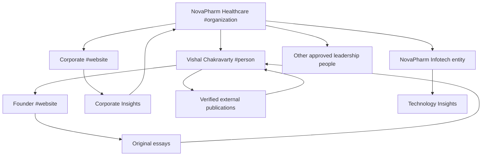

# Three-Site SEO, GEO and AEO Strategy

Status: repository eligibility implemented; live activation and outcomes pending
Review date: 1 August 2026
Owner: Content, Search and Corporate Governance

## Estate roles

| Property | Canonical purpose | Principal entity | Search role | Must not become |
|---|---|---|---|---|
| `novapharmhealthcare.com` | Corporate authority, capabilities, leadership, regulatory position, portfolio categories, partnerships and Insights | NovaPharm Healthcare | Primary company and B2B pharmaceutical-market authority | Patient sales site, medicine promotion or generic keyword directory |
| `nit.novapharmhealthcare.com` | Regulated-technology advisory, system architecture and evidence-led digital delivery | NovaPharm Infotech with its declared relationship to NovaPharm | Distinct technology expertise and qualified project discovery | Duplicate corporate content or an unverified separate legal company |
| `vishal.novapharmhealthcare.com` | Vishal Chakravarty's canonical professional record, original essays and verified external publications | Vishal Chakravarty | Person/entity authority and founder-led thought leadership | Duplicate company homepage or fabricated biography/press archive |

Each property has its own `WebSite` graph and canonicals. All three refer to the canonical NovaPharm organisation ID where relevant. Vishal has one Person ID across the estate. Cross-site links explain relationships; they do not create canonical duplication.

## GEO/AEO approach

Generative and answer-engine eligibility comes from the same useful public HTML required by people and search engines:

- concise answer-first openings;
- stable entities and dates;
- visible author/reviewer/source information;
- factual headings, tables, processes and definitions;
- explicit separation of current, planned and authorisation-dependent states;
- original operating frameworks rather than commodity summaries;
- server-rendered/generated text and crawlable links;
- accurate image context and rights;
- no AI-only page or hidden machine text.

This creates eligibility only. Search indexing, ranking, rich results, Knowledge Panels and AI citations are platform decisions and are not guaranteed.

## Canonical entity graph

Canonical IDs are defined in `packages/content` and `packages/seo`; application schema tests reject drift. Corporate leadership profile pages may describe a person but refer to the same canonical Person ID rather than minting a competing identity.

## Internal-link model

- Corporate capability and regulatory hubs link to directly relevant Corporate Insights.
- Corporate leadership links to approved profiles; Vishal's record links to his canonical founder property.
- Founder essays link to NovaPharm only where the corporate capability or fact is relevant.
- NIT links to NovaPharm when explaining the governed relationship, not as an SEO footer network.
- Cross-site anchor text describes the destination; no repetitive exact-match keyword scheme is used.

## International search

The estate is UK English first. Target markets are labelled as targets or analysis contexts, not current operating territories. No `hreflang`, machine-translated estate or country-page factory is launched until genuine reviewed regional/language equivalents exist. A country route requires materially local law, audience, evidence, service scope and owner approval.

## Authority roadmap

The 90-day calendar and twelve-month topic plan are maintained in `seo/content-authority-strategy.md`. Pillars cover UK market entry, sourcing resilience, PLPI assessment, WDA(H)/GDP readiness, CMO/CDMO qualification, oral-liquid transfer, batch integrity, post-Brexit pathways and regulated technology. Publication remains evidence- and reviewer-gated; cadence does not override quality.

## Validation

Repository checks cover metadata, canonicals, entities, schema syntax/linkage, sitemaps, robots, RSS, images, external publication metadata, internal links, private-route exclusion and IndexNow dry-run behaviour. Live activation is tracked separately in `search-platform-activation-register.md`.
