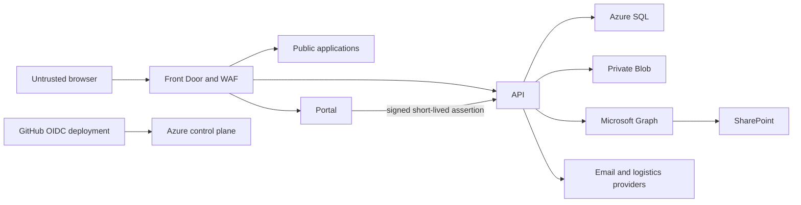

# Unified Estate Threat Model

Status: repository model complete; live validation and independent penetration test pending
Review date: 1 August 2026
Method: trust-boundary and STRIDE-informed review

## Trust boundaries

Public content, authenticated sessions, transactional APIs, private documents, external integrations and the deployment control plane are separate trust boundaries. Portal navigation never grants API or document access.

## Principal threats and controls

| Threat | Asset | Control | Remaining gate |
|---|---|---|---|
| Spoofed identity/header | Portal/API roles | Entra trusted-runtime checks, signed gateway assertion, nonce/replay checks, server scopes | Live Entra and penetration test |
| Customer IDOR | Orders, invoices, documents | SQL `customer_id` restrictions and customer-isolation tests | Azure SQL staging retest |
| Session theft/fixation | Privileged sessions | Opaque server sessions, signed Secure/HttpOnly cookies, rotation, idle/absolute expiry, revocation | Production cookie inspection |
| CSRF/replay | Mutations | SameSite cookie, token, exact Origin/Host, nonce/idempotency | Live edge/proxy retest |
| Injection/XSS | Database/browser | Parameterised queries, validation, encoding, CSP and test payloads | Independent DAST |
| Malicious upload | Private files | Size/count/MIME/extension checks, quarantine and scan-state release gate | Live malware scanner |
| Path traversal/public file leak | Documents/database/backups | Storage outside public roots, allowlisted delivery and private-file tests | Hosted storage test |
| Secret disclosure | Credentials/tokens | Key Vault target, managed identity, masked CI, tree/history scans | Tenant secrets and pull-ref support closure |
| Origin bypass | Applications | Front Door service tag plus exact profile ID, host validation | Live direct-origin test |
| WAF/bot/rate bypass | Availability/security | Managed rules, bot policy, global/sensitive limits, app-level limits | Live WAF test/tuning |
| Graph overreach/conflict | SharePoint | Least-privilege consent, selected scope, field authority, idempotent sync | Permission inventory/consent |
| Telemetry disclosure | Logs | Sensitive-route/payload exclusions and sanitised status service | Live log inspection |
| Supply-chain compromise | Source/dependencies | Exact lockfiles, audits, CodeQL, secret scan, protected review target | Enforced ruleset and final CI |
| Availability/data loss | Runtime/data | Candidate releases, health probes, backups, PITR/soft delete plans | Deployed restore/failover drill |

## Abuse cases

- An administrator requests another customer's document: reject unless the resource-level policy separately authorises it; admin scope is not a bypass.
- A different Azure Front Door profile targets an origin: App Service must reject the wrong `X-Azure-FDID` despite the shared service tag.
- Graph returns `429` or is unavailable: honour retry delay, retain outbox state and show a safe unavailable status.
- A public applicant uploads executable content renamed as PDF: MIME/signature checks and quarantine prevent release.
- A temporary password is used for board/admin data: force password replacement and deny confidential routes first.

Critical/high findings block release. Repository tests do not replace an independent penetration test against deployed staging.
